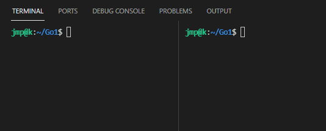

# Golang-RabbitMQ

Using Golang to establish connection between publisher and consumer via RabbitMQ. (amqp library: https://github.com/streadway/amqp)

    sudo docker run -d --hostname my-rabbit -p 15672:15672  -p 5672:5672 rabbitmq:3-management

    http://localhost:15672/
    username:guest
    username:guest

    export GO111MODULE="on" 

    go get github.com/streadway/amqp

    go run publisher.go 
    go run consumer.go

